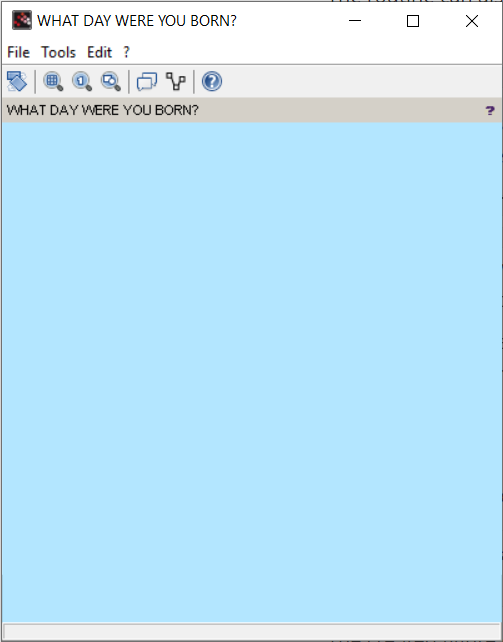

This first example is copied from [the scilab.org](https://help.scilab.org/docs/6.0.0/en_US/uicontrol.html) website and by the end you will learn to create a `figure` and add a `textlist` and put some selectable `string`s in it. Pretty much this:

&nbsp;

<p align="center">
<center>

</center>
</p>

&nbsp;

The first thing to learn is the [initialization routine](https://help.scilab.org/doc/5.5.2/en_US/figure.html) `figure()` for figure class. The constructor creates an empty window. It can be used with no parameters at all, which creates a square window with grayish background (`[0.94 0.94 0.94]`) and default dimensions (`[200, 200, 610, 460]`), and assign the first unoccupied (if that is a word?) integer as the ID. For example if there have been no other mention of the routine it will assign an ID of `1`. However for more control one can assign the ID manually by specifying an integer `figure(<num>)`:

```scilab
f = figure(3);
```

The routine can also be used in a more elaborate way if one requires to control more properties of the empty window:

```scilab
f = figure(<num>, "PropertyName_1", PropertyValue_1, ... , "PropertyName_N", PropertyValue_N);
```
These properties correspond to the figure object attributes listed [here](https://help.scilab.org/doc/5.5.2/en_US/figure_properties.html).
Here we will discuss some of the properties and the values they can take. There are more which you can see on [the scilab.org entry for the routine](https://help.scilab.org/doc/5.5.2/en_US/figure.html).

- `BackgroundColor` : which as the name says indicates the background color of the main figure. It accepts a `[1, 3]` vector of `[R G B]` or a string of `"R|G|B"` where the elements are real numbers between `0-1` with 1 being the highest saturation. Hence `[1 1 1]` and `[0 0 0]` will lead to a complete white or back backgrounds respectively.
- `Position` : specifies the position of top left corner of the window in respect to the screen and height and width of the window itself in the for mat of a `[1, 4]` vector of integers `[x y w h]` or a string of `"x|y|w|h"`. The values are in the unit of pixels and the origin of coordinate system is top left corner of the screen.
- `Figure_name` : this is just a string in quotation `'Some random title'`

For example the command from [here](http://mailinglists.scilab.org/Scilab-users-Exporting-graphic-figure-and-its-calcs-td4036494.html):

```scilab
h = figure('position', [50 50 400 400], 'backgroundcolor', [0.7 0.9 1], ..
"figure_name", 'WHAT DAY WERE YOU BORN?');
```

will give you:

&nbsp;

<center>

</center>

&nbsp;


The created figure object (`f` in the example above) also has a whole lots of [attributes](https://help.scilab.org/doc/6.0.0/en_US/figure_properties.html) which can be accessed as

 * `f.PropertyName` or `get(f, "PropertyName")` to read
 * `f.PropertyName = PropertyValue` or `set(f, "PropertyName", PropertyValue)`adjust

certain configurations of the window. `figure_position`, `figure_size`, `figure_name` /`name`, ... which will later cover in details. Also other important routines of this class are `scf()`, `clf`, `gcf()`, `close()` again to be covered later.

Next command in this example is the `uicontrol()` which is the initialization routine of its class. It creates objects inside a figure:

```scilab
h = uicontrol(figureID, "PropertyName", PropertyValue, ...);
```

The `uicontrol` has lots of properties which we will discuss later but the ones used in this example are `style` and `position`. `style` pretty much specifies what type of GUI object we want to add to the figure. There are several options including `Checkbox`, `Edit`, `Image`, ... the one used in this example is a `Listbox` which shows the list of selectable items. The other property used in this example is the `position` which is a `[1, 4]` vector of integers `[x, y, w, h]` or`"x|y|w|h"`. One difference between this and the figure object above is that `y` is in respect to the bottom of the figure. In other words the origin of coordinate system here is the left bottom corner of the figure.


Now running the command:

```scilab
h = uicontrol(f, 'style', 'listbox', 'position', [30 10 100 200]);
```

&nbsp;

<center>

</center>

&nbsp;

now we can populate the `Listbox` with some `string`s:

```scilab
set(h, 'string', "item 1|item 2|item 3");
```

Unfortunately a default figure object comes with many unnecessary features. They can be removed:

```scilab
FigureNumber = 1002;
MainFigure = figure(FigureNumber,...
    'menubar_visible', 'off',...
    'toolbar_visible', 'off',...
    'infobar_visible', 'off',...
    'dockable', 'off'...
    );
```
