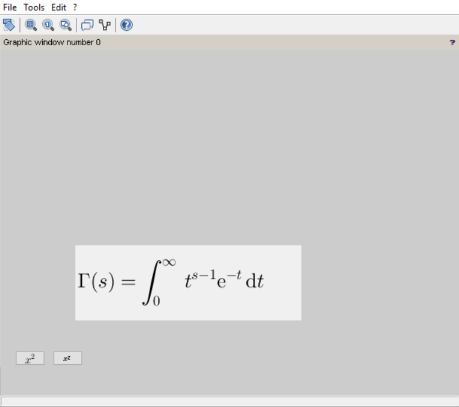
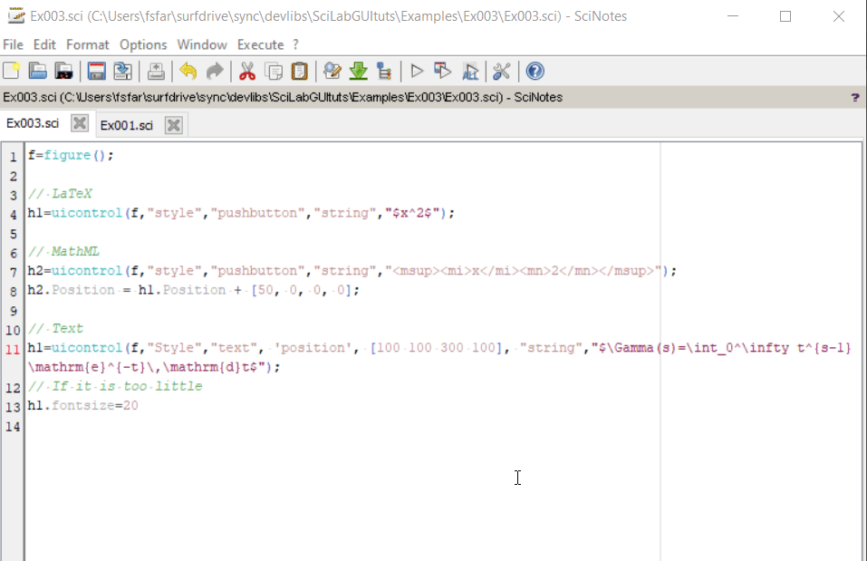

This example has been copied from the [scilab.org](https://help.scilab.org/docs/6.0.0/en_US/uicontrol.html) showing how you can render LaTeX and MathML mathematical equations. Syntax is pretty much straigh forward. For LaTeX equation `$...$` is used.

Also a nice feature of the SciLab editor (Scinotes) is the ability to render LaTeX equation by hovering the mouse over the strings:

This example does not work in ScicosLab and its editor Scipad.
