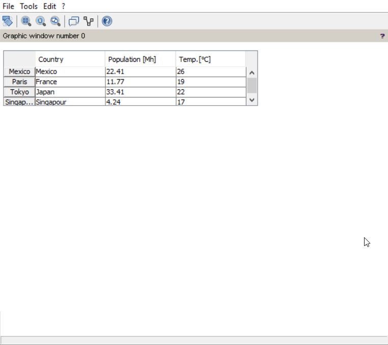

This example is copied from [scilab.org](https://help.scilab.org/docs/6.0.0/en_US/uicontrol.html) to show how an editable table can be added to the GUI. A `[5 4]` table (default Scilab matrix type) of strings is prepared first.  Then the `gcf()` will assign the current/active figure (get current figure). In the case where there is no figure this will create new one. The `clf` will clear the current figure (in the case there have been some features there). The `.axes_size` attribute will extract the width and height of the figure object, which is used to make sure the table is shown on top left corner:


&nbsp;

<p align="center">

</p>

&nbsp;

The you can modify by hand some values in the table. Then get them back from the ui:

```scilab
matrix(get(ut, "string"), size(table))
```


This example is not applicable in ScicosLab due to the lack of table style for `uicontrol`.
