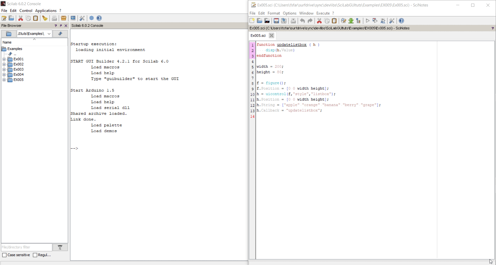

This example has been copied from [scilab.org](https://wiki.scilab.org/howto/guicontrol). A selectable list of items `listbox` is created and where upon selection their rank in the list is displayed in the terminal:

&nbsp;

&nbsp;

Any `uicontrol` object has a `.Callback` attribute (or `"calback"`  property for the `uicontrol()` initialization function and `set` and `get` routines) which upon certain interactions with the object runs a given string as SciLab commands or a given Scilab function. In this case clicking on any of the items in the list firstly changes the `.Value` attribute (`value` property) of the `listbox` to the rank of the selected item and then runs the `updateListBox` function, printing out the value into the console.

This example is not applicable to ScicosLab due to the issue with the callback of a `listbox` which has been reported [here](https://stackoverflow.com/questions/55388629/assigning-callback-to-the-uicontrol-object-leads-to-tcl-error-unknown-option-c).
