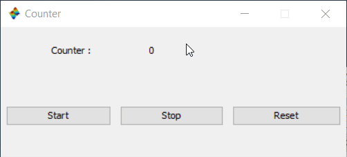

This example has been copied from [scilab.org](https://help.scilab.org/docs/6.0.0/ru_RU/uicontrol_properties.html). 

In this example you will learn to have interupting `callback` functions, as well as `createConstraints`. The `Callback_Type` property accepts values of

 * `-1` implying that no call back instructions or function will be triggered.
 * `0` the default value meaning a Scilab instruction in the form of a string will be run.
 * `2` a callback function will be triggered. It is already included in `0`.
 * `10` implying a Scilab expression will be run but interrupting any other processes done by the interpreter.
 * `12` a more specific case of `10` running only a function.

there is also a `1` value which refers to:

> Cor a Fortran function

I don't know what this means and couldn't find any documentations explaining details!

It worth noting that `10` and `12` are interrupting forms of `0` and `2`, and `0` and `10` also do the job of `2` and `12` but not vise versa.

